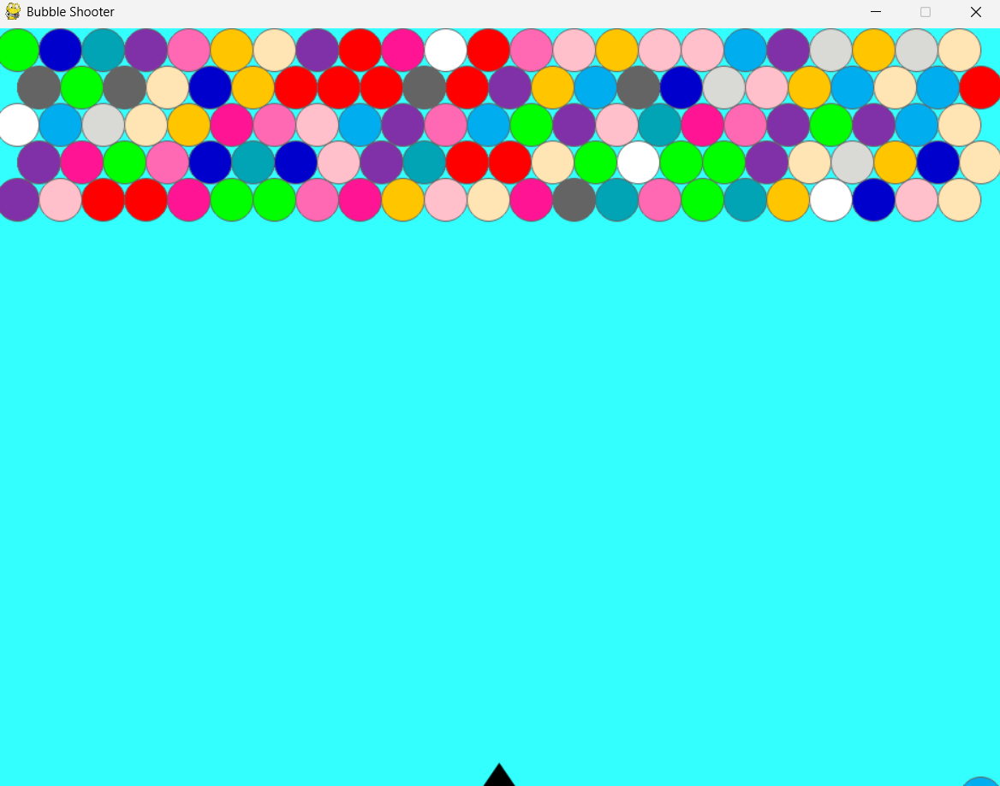

# 🎯 Bubble Shooter Game — Pygame Edition

Welcome to the classic **Bubble Shooter** game recreated in **Python using Pygame** — now with smooth animations, arcade-style sounds, and addictive gameplay.

 <!-- Optional: Add your game screenshot here -->

---

## 🚀 Features

- 🎮 Classic bubble shooting mechanics
- 🔊 Arcade-style sound effects and background music
- 🎯 Real-time aiming with arrow controls
- 🎨 Color-matching & popping bubbles
- 🧠 Smart logic for row drops and new bubble addition
- 🖼️ Simple and clean UI using `pygame.gfxdraw`

---

## 🕹️ How to Play

- Use **Left** and **Right Arrow Keys** to aim
- Press **Spacebar** to shoot the bubble
- Match **3 or more bubbles** of the same color to pop them
- Prevent bubbles from reaching the bottom of the screen

---

## 🧩 Controls

| Key | Action           |
|-----|------------------|
| ←   | Move arrow left  |
| →   | Move arrow right |
| Spacebar | Shoot bubble   |
| ESC | Quit the game    |

---

## 🔧 Requirements

- Python 3.x
- Pygame

Install dependencies with:

```bash
pip install pygame
